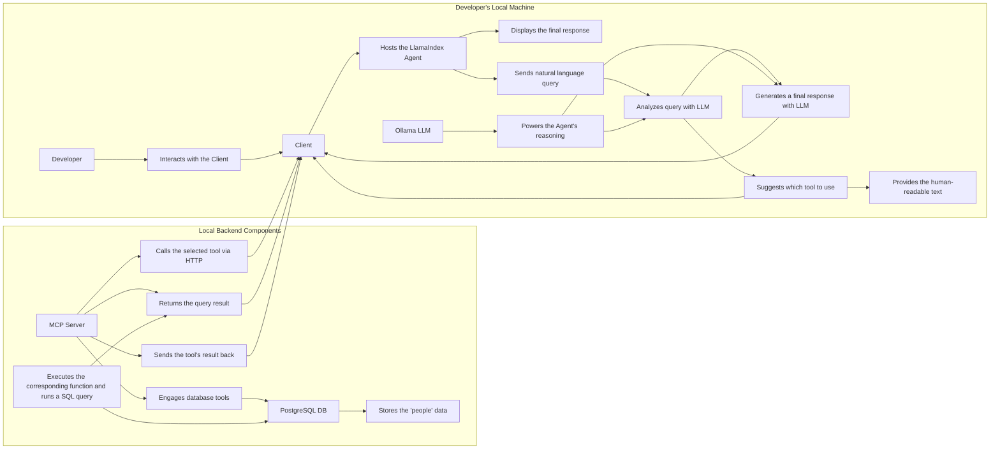
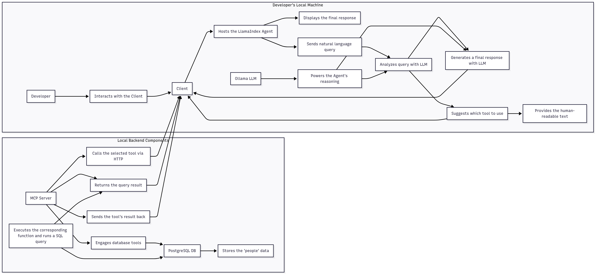

# Local MCP Client with LlamaIndex and PostgreSQL

This project demonstrates how to build a **local MCP (Model Context Protocol) client** using LlamaIndex that connects to a local PostgreSQL database. The agent can interact with the database using natural language, powered by a local LLM (Ollama) and a tool-calling agent.

 

### Tech Stack
- **LlamaIndex**: Framework for building context-aware LLM applications.
- **MCP (Model Context Protocol)**: A protocol for agents to communicate with tools.
- **Ollama**: For running local LLMs (e.g., Llama 3.2).
- **PostgreSQL**: The relational database.
- **uv**: For environment and package management.

---

### Setup

1.  **Install Dependencies**:
    Make sure you have `uv` installed. Then, sync the dependencies:
    ```sh
    uv sync
    ```

2.  **Set up PostgreSQL**:
    - Ensure you have PostgreSQL installed and running.
    - Create a database named `mcp_example`.
    - Update the connection details in `server.py` if they are different from the defaults (user: `postgres`, password: `postgres`).

---

### Usage

1.  **Start the MCP Server**:
    Open a terminal and run the server. It will automatically create the `people` table in your database.
    ```sh
    uv run server.py --server_type=sse
    ```
    The server will be running on `http://127.0.0.1:8000`.

2.  **Run the Client**:
    Open a second terminal and run the client:
    ```sh
    uv run client.py
    ```

3.  **Interact with the Agent**:
    You can now chat with the agent in your terminal. Try some of the example commands:
    - `show data`
    - `get table info`
    - `add Jane Doe, 32 years old, data scientist`
    - `show people younger than 30`
    - `how many people are there?`

---

### How It Works

-   **`server.py`**: This script starts an MCP server that exposes several tools (`add_data`, `add_person`, `read_data`, `get_table_info`) that interact with the PostgreSQL database.
-   **`client.py`**: This script initializes a LlamaIndex `FunctionAgent` with a local Ollama LLM. The agent connects to the MCP server, gets the list of available tools, and uses them to answer your queries.
-   **System Prompt**: The `SYSTEM_PROMPT` in `client.py` guides the agent on how to behave, ensuring it calls the tools correctly and provides user-friendly responses.

---

### Contribution

Contributions are welcome! Please fork the repository and submit a pull request with your improvements.

---

## 📬 Stay Updated with Our Newsletter!
**Get a FREE Data Science eBook** 📖 with 150+ essential lessons in Data Science when you subscribe to our newsletter! Stay in the loop with the latest tutorials, insights, and exclusive resources. [Subscribe now!](https://join.dailydoseofds.com)

[](https://join.dailydoseofds.com)


## Architecture



# local-mcp
