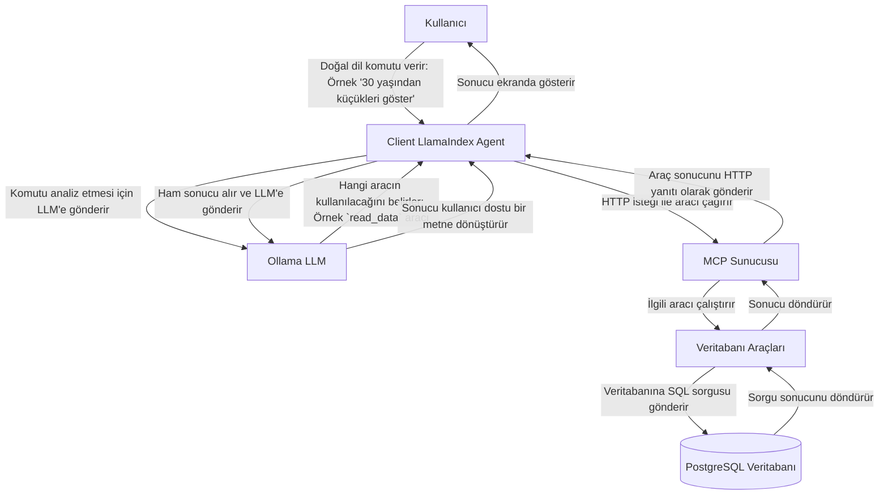

Problem: Yapay Zeka Ajanları ve Araçlar

Günümüzdeki büyük dil modelleri (LLM'ler) metin üretme ve anlama konusunda inanılmaz derecede yetenekli. Ancak tek başlarına, dış dünyayla etkileşim kuramazlar. Yani bir veritabanını sorgulayamaz, bir e-posta gönderemez veya bir takvime etkinlik ekleyemezler.

Bu yetenekleri kazanmaları için "araçlara" (tools) ihtiyaç duyarlar. Bir araç, belirli bir görevi yerine getiren basit bir program olabilir; örneğin, veritabanından müşteri bilgilerini çeken bir fonksiyon gibi.

Ancak burada bir sorun ortaya çıkıyor: Her geliştirici, kendi ajanları için özel araç entegrasyonları yazdığında, ortaya standart olmayan, karmaşık ve güvenliği zor bir yapı çıkıyor. Bir ajanın yeni bir aracı nasıl keşfedeceği ve kullanacağı belirsizleşiyor.

Çözüm: Model Context Protocol (MCP)

İşte Model Context Protocol (MCP) tam da bu noktada devreye giriyor. MCP, yapay zeka ajanlarının ve araçların birbirleriyle iletişim kurabilmesi için oluşturulmuş bir standart protokoldür. Tıpkı web siteleri için HTTP'nin bir standart olması gibi, MCP de ajan-araç iletişimi için bir standart sunar.

MCP'nin sağladığı temel faydalar şunlardır:

Keşfedilebilirlik: Bir ajan, bir MCP sunucusuna bağlanıp "Hangi araçlara sahipsin?" diye sorabilir. Sunucu da sahip olduğu araçları ve nasıl kullanılacaklarını listeleyebilir.
Standardizasyon: Tüm araçlar aynı protokol üzerinden konuştuğu için, bir ajan bir aracı nasıl kullanacağını öğrendiğinde, diğer binlerce aracı da aynı şekilde kullanabilir. Bu, geliştirme sürecini büyük ölçüde basitleştirir.
Güvenlik: Standart bir protokol, izinler, kimlik doğrulama ve veri gizliliği gibi güvenlik katmanlarının uygulanmasını kolaylaştırır.

Bu Projede MCP Nasıl Çalışıyor?

Şimdi bu local-mcp projesinin mimarisine ve iş akışına bakalım. Aşağıdaki diyagram bu süreci özetliyor:

Kullanıcı Komutu: Her şey sizin terminale "30 yaşından küçük kişileri göster" gibi bir komut yazmanızla başlar.
Client (Ajan): client.py içinde çalışan LlamaIndex ajanı bu komutu alır.
LLM Analizi: Ajan, bu komutu ne anlama geldiğini ve hangi eylemin gerçekleştirilmesi gerektiğini anlaması için yerel olarak çalışan Ollama LLM'e gönderir. LLM, bu görev için veritabanından veri okunması gerektiğine ve bunun için read_data aracının uygun olduğuna karar verir.
MCP Çağrısı: Ajan, server.py tarafından çalıştırılan MCP sunucusuna bir HTTP isteği gönderir ve read_data aracını uygun parametrelerle çağırır.
MCP Sunucusu: Sunucu bu isteği alır, read_data fonksiyonunu çalıştırır. Bu fonksiyon, PostgreSQL veritabanına ilgili SQL sorgusunu gönderir.
Veritabanı İşlemi: Veritabanı sorguyu çalıştırır ve sonuçları (örneğin, kişi listesini) sunucuya geri gönderir.
Sonucun Geri Dönüşü: Sunucu, veritabanından aldığı sonucu HTTP yanıtı olarak ajana geri gönderir.
Nihai Yanıt: Ajan, ham veriyi alır ve tekrar LLM'i kullanarak bunu "İşte 30 yaşından küçük kişiler: ..." gibi doğal ve anlaşılır bir dilde size sunar.